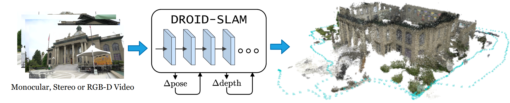
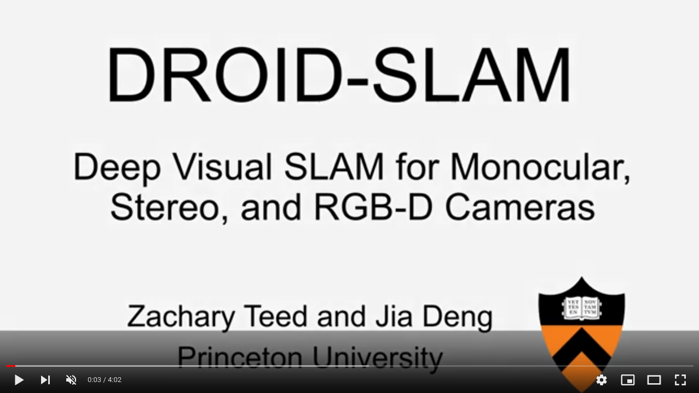

# DROID-SLAM


<!-- <center></center> -->


[](https://www.youtube.com/watch?v=GG78CSlSHSA)


[DROID-SLAM: Deep Visual SLAM for Monocular, Stereo, and RGB-D Cameras](https://arxiv.org/abs/2108.10869)  
Zachary Teed and Jia Deng

```
@article{teed2021droid,
  title={{DROID-SLAM: Deep Visual SLAM for Monocular, Stereo, and RGB-D Cameras}},
  author={Teed, Zachary and Deng, Jia},
  journal={Advances in neural information processing systems},
  year={2021}
}
```

**Initial Code Release:** This repo currently provides a single GPU implementation of our monocular, stereo, and RGB-D SLAM systems. It currently contains demos, training, and evaluation scripts. 


## Requirements

To run the code you will need ...
* **Inference:** Running the demos will require a GPU with at least 11G of memory. 

* **Training:** Training requires a GPU with at least 24G of memory. We train on 4 x RTX-3090 GPUs.

## Getting Started
1. Clone the repo using the `--recursive` flag
```Bash
git clone --recursive https://github.com/princeton-vl/DROID-SLAM.git
```

2. Creating a new anaconda environment using the provided .yaml file. Use `environment_novis.yaml` to if you do not want to use the visualization
```Bash
conda env create -f environment.yaml
pip install evo --upgrade --no-binary evo
pip install gdown
```

3. Compile the extensions (takes about 10 minutes)
```Bash
python setup.py install
```


## Demos

1. Download the model from google drive: [droid.pth](https://drive.google.com/file/d/1PpqVt1H4maBa_GbPJp4NwxRsd9jk-elh/view?usp=sharing)

2. Download some sample videos using the provided script.
```Bash
./tools/download_sample_data.sh
```

Run the demo on any of the samples (all demos can be run on a GPU with 11G of memory). While running, press the "s" key to increase the filtering threshold (= more points) and "a" to decrease the filtering threshold (= fewer points). To save the reconstruction with full resolution depth maps use the `--reconstruction_path` flag.


```Python
python demo.py --imagedir=data/abandonedfactory --calib=calib/tartan.txt --stride=2
```

```Python
python demo.py --imagedir=data/sfm_bench/rgb --calib=calib/eth.txt
```

```Python
python demo.py --imagedir=data/Barn --calib=calib/barn.txt --stride=1 --backend_nms=4
```

```Python
python demo.py --imagedir=data/mav0/cam0/data --calib=calib/euroc.txt --t0=150
```

```Python
python demo.py --imagedir=data/rgbd_dataset_freiburg3_cabinet/rgb --calib=calib/tum3.txt
```


**Running on your own data:** All you need is a calibration file. Calibration files are in the form 
```
fx fy cx cy [k1 k2 p1 p2 [ k3 [ k4 k5 k6 ]]]
```
with parameters in brackets optional.

## Evaluation
We provide evaluation scripts for TartanAir, EuRoC, and TUM. EuRoC and TUM can be run on a 1080Ti. The TartanAir and ETH will require 24G of memory.

### TartanAir (Mono + Stereo)
Download the [TartanAir](https://theairlab.org/tartanair-dataset/) dataset using the script `thirdparty/tartanair_tools/download_training.py` and put them in `datasets/TartanAir`
```Bash
./tools/validate_tartanair.sh --plot_curve            # monocular eval
./tools/validate_tartanair.sh --plot_curve  --stereo  # stereo eval
```

### EuRoC (Mono + Stereo)
Download the [EuRoC](https://projects.asl.ethz.ch/datasets/doku.php?id=kmavvisualinertialdatasets) sequences (ASL format) and put them in `datasets/EuRoC`
```Bash
./tools/evaluate_euroc.sh                             # monocular eval
./tools/evaluate_euroc.sh --stereo                    # stereo eval
```

### TUM-RGBD (Mono)
Download the fr1 sequences from [TUM-RGBD](https://vision.in.tum.de/data/datasets/rgbd-dataset/download) and put them in `datasets/TUM-RGBD`
```Bash
./tools/evaluate_tum.sh                               # monocular eval
```

### ETH3D (RGB-D)
Download the [ETH3D](https://www.eth3d.net/slam_datasets) dataset
```Bash
./tools/evaluate_eth3d.sh                             # RGB-D eval
```

## Training

First download the TartanAir dataset. The download script can be found in `thirdparty/tartanair_tools/download_training.py`. You will only need the `rgb` and `depth` data.

```
python download_training.py --rgb --depth
```

You can then run the training script. We use 4x3090 RTX GPUs for training which takes approximatly 1 week. If you use a different number of GPUs, adjust the learning rate accordingly.

**Note:** On the first training run, covisibility is computed between all pairs of frames. This can take several hours, but the results are cached so that future training runs will start immediately. 


```
python train.py --datapath=<path to tartanair> --gpus=4 --lr=0.00025
```


## Acknowledgements
Data from [TartanAir](https://theairlab.org/tartanair-dataset/) was used to train our model. We additionally use evaluation tools from [evo](https://github.com/MichaelGrupp/evo) and [tartanair_tools](https://github.com/castacks/tartanair_tools).
